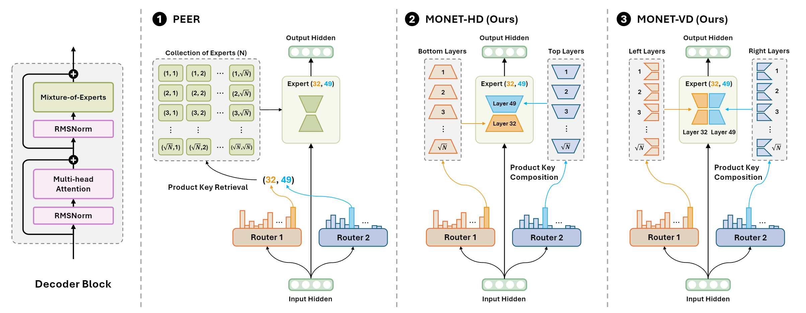

# Monet: Mixture of Monosemantic Experts for Transformers

[](https://arxiv.org/abs/2412.04139)
[](https://huggingface.co/MonetLLM)
[](https://huggingface.co/spaces/MonetLLM/monet-vd-1.4B-100BT-hf-viewer)
[](https://github.com/dmis-lab/Monet)
[](./LICENSE)



## Introduction

**Monet** presents a novel approach to enhancing mechanistic interpretability in large language models (LLMs) through an innovative Sparse Mixture-of-Experts (SMoE) architecture. By directly incorporating sparse dictionary learning into end-to-end pretraining, **Monet** addresses the fundamental challenge of polysemanticity - where individual neurons respond to multiple unrelated concepts - while maintaining model performance.

#### ✨Key Highlights

- 📈 **Scalable Expert Architecture**: **Monet** introduces parameter-efficient expert decomposition methods that enable scaling to 262,144 experts per layer while ensuring total parameters scale proportionally to the square root of expert count.
- 📊 **Monosemantic Experts**: Through fine-grained expert specialization, **Monet** achieves monosemantic experts that demonstrate mutual exclusivity of knowledge, allowing transparent observation of model behavior and parametric knowledge.
- 🛠️ **Robust Knowledge Control**: The architecture enables precise manipulation of domain-specific knowledge, language capabilities, and toxicity mitigation without compromising general performance.

### Why Monet?

Unlike traditional approaches using post-hoc reconstruction (like Sparse Autoencoders), **Monet** integrates interpretability directly into its architecture. This enables both transparent understanding of model internals and fundamental behavior control. By scaling monosemantic experts, Monet paves the way for more transparent and controllable language models.

## News

- **2024-12-06**: Released **Monet: Mixture of Monosemantic Experts for Transformers** on [arXiv](https://arxiv.org/abs/2412.04139), with [GitHub](https://github.com/dmis-lab/Monet), [models](https://huggingface.co/MonetLLM), and [demo](https://huggingface.co/spaces/MonetLLM/monet-vd-1.4B-100BT-hf-viewer).

## Model Checkpoints

#### Base Models

<table class="center">
    <tr>
        <td align="center"><b>Model</b></td>
        <td align="center"><b>Dataset</b></td>
        <td align="center"><b>#Params</b></td>
        <td align="center"><b>#Tokens</b></td>
        <td align="center"><b>Checkpoint</b></td>
        <td align="center"><b>Demo</b></td>
    </tr>
    <tr>
        <td align="center" rowspan="4"><b>Monet-VD</b></td>
        <td align="center" rowspan="3"><a href="https://huggingface.co/datasets/HuggingFaceFW/fineweb-edu">FineWeb-Edu</a></td>
        <td align="center">850M</td>
        <td align="center">100BT</td>
        <td>🤗<a href="https://huggingface.co/MonetLLM/monet-vd-850M-100BT-hf">monet-vd-850M-100BT-hf</a></td>
        <td></td>
    </tr>
    <tr>
        <td align="center">1.4B</td>
        <td align="center">100BT</td>
        <td>🤗<a href="https://huggingface.co/MonetLLM/monet-vd-1.4B-100BT-hf">monet-vd-1.4B-100BT-hf</a></td>
        <td>🔍<a href="https://huggingface.co/spaces/MonetLLM/monet-vd-1.4B-100BT-hf-viewer">Viewer</a></td>
    </tr>
    <tr>
        <td align="center">4.1B</td>
        <td align="center">100BT</td>
        <td>🤗<a href="https://huggingface.co/MonetLLM/monet-vd-4.1B-100BT-hf">monet-vd-4.1B-100BT-hf</a></td>
        <td></td>
    </tr>
    <tr>
        <td align="center"><a href="https://huggingface.co/datasets/bigcode/starcoderdata">StarCoderData</a></td>
        <td align="center">1.4B</td>
        <td align="center">100BT</td>
        <td>🤗<a href="https://huggingface.co/MonetLLM/codemonet-vd-1.4B-100BT-hf">codemonet-vd-1.4B-100BT-hf</a></td>
        <td>🔍<a href="https://huggingface.co/spaces/MonetLLM/codemonet-vd-1.4B-100BT-hf-viewer">Viewer</a></td>
    </tr>
    <tr>
        <td align="center" rowspan="3"><b>Monet-HD</b></td>
        <td align="center" rowspan="3"><a href="https://huggingface.co/datasets/HuggingFaceFW/fineweb-edu">FineWeb-Edu</a></td>
        <td align="center">850M</td>
        <td align="center">100BT</td>
        <td>🤗<a href="https://huggingface.co/MonetLLM/monet-hd-850M-100BT-hf">monet-hd-850M-100BT-hf</a></td>
        <td></td>
    </tr>
    <tr>
        <td align="center">1.4B</td>
        <td align="center">100BT</td>
        <td>🤗<a href="https://huggingface.co/MonetLLM/monet-hd-1.4B-100BT-hf">monet-hd-1.4B-100BT-hf</a></td>
        <td></td>
    </tr>
    <tr>
        <td align="center">4.1B</td>
        <td align="center">100BT</td>
        <td>🤗<a href="https://huggingface.co/MonetLLM/monet-hd-4.1B-100BT-hf">monet-hd-4.1B-100BT-hf</a></td>
        <td></td>
    </tr>
</table>

#### Instruction-Tuned Models

<table class="center">
    <tr>
        <td align="center"><b>Model</b></td>
        <td align="center"><b>Purpose</b></td>
        <td align="center"><b>Recipe</b></td>
        <td align="center"><b>#Params</b></td>
        <td align="center"><b>Checkpoint</b></td>
    </tr>
    <tr>
        <td align="center" rowspan="2"><b>Monet-VD</b></td>
        <td align="center">Chat Completion</td>
        <td align="center"><a href="https://github.com/huggingface/alignment-handbook/tree/main/recipes/smollm">SmolLM</a></td>
        <td align="center">1.4B</td>
        <td>🤗<a href="https://huggingface.co/MonetLLM/monet-vd-1.4B-100BT-chat-hf">monet-vd-1.4B-100BT-chat-hf</a></td>
    </tr>
    <tr>
        <td align="center">Vision-Language Model</td>
        <td align="center"><a href="https://github.com/haotian-liu/LLaVA">LLaVA</a></td>
        <td align="center">1.6B</td>
        <td>🤗<a href="https://huggingface.co/MonetLLM/visionmonet-vd-1.4B-100BT-hf">visionmonet-vd-1.4B-100BT-hf</a></td>
    </tr>
</table>

## Quickstart

You can explore the core implementation of **Monet** in [modeling_monet.py](./modeling_monet.py). We've made it easy to use Monet by including our custom code in the 🤗[Hugging Face model zoo](https://huggingface.co/MonetLLM). Simply set `trust_remote_code=True` when loading the models through the Transformers library.

### Text Generation

```python
from transformers import pipeline

model_name = "MonetLLM/monet-vd-1.4B-100BT-hf"
pipe = pipeline(
    "text-generation",
    model_name,
    tokenizer=AutoTokenizer.from_pretrained(model_name),
    torch_dtype=torch.bfloat16,
    device_map="auto",
    trust_remote_code=True,
)
print(pipe("The key to life is", max_new_tokens=20, do_sample=True)[0]["generated_text"])
```

Output:

```
<s> The key to life is learning how to live creatively. The question is: how do we do that, and what will
```

### Code Generation

```python
from transformers import pipeline

model_name = "MonetLLM/codemonet-vd-1.4B-100BT-hf"
pipe = pipeline(
    "text-generation",
    model_name,
    tokenizer=AutoTokenizer.from_pretrained(model_name),
    torch_dtype=torch.bfloat16,
    device_map="auto",
    trust_remote_code=True,
)

text = '''
def print_len(x: str):
    """For a given string x, print the length of x."""
'''
print(pipe(text, max_new_tokens=10)[0]["generated_text"].split("\n\n")[0])
```

Output:

```
<s>
def print_len(x: str):
    """For a given string x, print the length of x."""
    print(len(x))
```

### Chat Completion

```python
from transformers import pipeline

model_name = "MonetLLM/codemonet-vd-1.4B-100BT-chat-hf"
pipe = pipeline(
    "text-generation",
    model_name,
    tokenizer=AutoTokenizer.from_pretrained(model_name),
    torch_dtype=torch.bfloat16,
    device_map="auto",
    trust_remote_code=True,
)

text = tokenizer.apply_chat_template(
    [{"role": "user", "content": "Hi! How are you?"}],
    add_generation_prompt=True,
    tokenize=False,
)
print(pipe(text, max_new_tokens=30, do_sample=True)[0]["generated_text"])
```

Output:

```
<s>[INST] Hi! How are you? [/INST] I'm good, thanks! How can I help you today? </s>
```

### Using vLLM

For enhanced inference performance, **Monet** can be integrated with the vLLM engine. Note that **Monet** requires manual registration with vLLM's `ModelRegistry` before initialization. The custom implementation is provided in [modeling_monet_vllm.py](./modeling_monet_vllm.py).

```python
from vllm import LLM, ModelRegistry, SamplingParams
from modeling_monet_vllm import MonetForCausalLM

# Register Monet architecture with vLLM
ModelRegistry.register_model("MonetForCausalLM", MonetForCausalLM)

model = LLM(
    "MonetLLM/monet-vd-1.4B-100BT-hf",
    trust_remote_code=True,
    dtype="bfloat16",
    gpu_memory_utilization=0.8
)
sampling_params = SamplingParams(max_tokens=20, temperature=1.0)
print(model.generate("The key to life is", sampling_params)[0].outputs[0].text)
```
Output:
```
 what you’re born with. If you think that you don’t have the same control and
```

### Get Expert Routing Probabilities

Based on expert routing probabilities, **Monet** enables mechanistic interpretability by understanding which sparse features are activated to which token. Following the standard MoE approach, you can obtain expert routing probabilities for all layers by setting `output_router_probs=True`. The example below demonstrates how to compute and analyze the expert activation patterns:

```python
import torch
from transformers import AutoModelForCausalLM, AutoTokenizer

model = AutoModelForCausalLM.from_pretrained(
    "MonetLLM/monet-vd-1.4B-100BT-hf",
    torch_dtype=torch.bfloat16,
    device_map="auto",
    trust_remote_code=True,
)
tokenizer = AutoTokenizer.from_pretrained("MonetLLM/monet-vd-1.4B-100BT-hf")

inputs = tokenizer("City and County of San Francisco", return_tensors="pt")
outputs = model(**inputs.to(model.device), output_router_probs=True)

# Get full expert routing probabilities: [batch_size, seq_len, moe_heads, moe_experts**2]
g1, g2 = outputs.router_probs[0][0], outputs.router_probs[0][1]
g = torch.einsum("bthi,bthj->bthij", g1, g2).flatten(-2)
print(g.shape)

# Print number of activated experts per token.
for token, routing in zip(inputs.input_ids.squeeze(0), g.squeeze(0)):
    token = tokenizer.decode(token).ljust(16, " ")
    expert_indices = (routing.sum(0) > 1e-2).argwhere().squeeze(-1)
    print(f"Token: {token} Activated Experts: {len(expert_indices)}")
```

Output:

```
torch.Size([1, 7, 8, 262144])
Token: <s>              Activated Experts: 62
Token: City             Activated Experts: 60
Token: and              Activated Experts: 16
Token: County           Activated Experts: 102
Token: of               Activated Experts: 11
Token: San              Activated Experts: 70
Token: Francisco        Activated Experts: 67
```

## Citation
Please cite related papers/blogs using this BibTeX if you find this useful for your research and applications.
```bibtex
@misc{park2024monetmixturemonosemanticexperts,
      title={Monet: Mixture of Monosemantic Experts for Transformers}, 
      author={Jungwoo Park and Young Jin Ahn and Kee-Eung Kim and Jaewoo Kang},
      year={2024},
      eprint={2412.04139},
      archivePrefix={arXiv},
      primaryClass={cs.AI},
      url={https://arxiv.org/abs/2412.04139}, 
}
```
